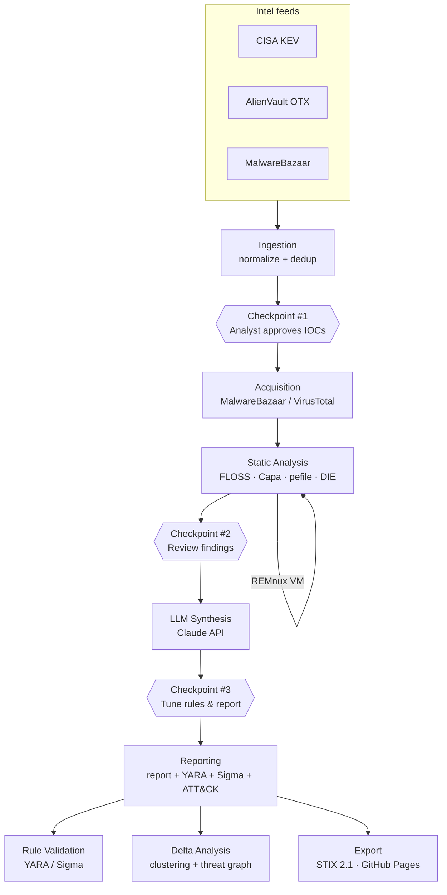

# Architecture Overview

Mal-Intel-Pipeline is a staged, human-in-the-loop malware intelligence pipeline.
Each stage is independently runnable and writes structured artifacts that the next
stage consumes. Three analyst checkpoints gate the flow so a human approves what
gets acquired, reviews static-analysis findings, and tunes LLM output before export.

Static analysis runs on an **isolated REMnux VM** reached over a dedicated host-only
network; the host orchestrates and never detonates samples itself.

## Stage responsibilities

| Stage | Package | Output |
|-------|---------|--------|
| Ingestion | `pipeline/ingestion` | Normalized, de-duplicated IOCs + checkpoint manifest |
| Acquisition | `pipeline/acquisition` | Encrypted sample in `samples/quarantine` |
| Static analysis | `pipeline/static_analysis` | Per-sample `*.analysis.json` (run on REMnux) |
| Scoring / triage | `pipeline/scoring` | Priority score per sample |
| LLM synthesis | `pipeline/llm_synthesis` | Draft report, rules, ATT&CK mapping |
| Reporting | `pipeline/reporting` | Analyst + executive reports |
| Rule validation | `pipeline/rule_validation` | Validated YARA / Sigma rules |
| Delta analysis | `pipeline/delta_analysis` | Family clustering + threat graph |
| Export | `pipeline/export` | STIX 2.1 bundle, published analysis posts |
| RAG assistant | `pipeline/rag` | Natural-language Q&A over the corpus |

## Data & trust boundaries

- **Secrets** live only in `config/secrets.env` (git-ignored). `config/secrets.env.template`
  documents the required keys and is the only secrets artifact in version control.
- **Samples** never leave `samples/` and are never committed; only derived analysis
  JSON and reports cross back to the host.
- **Host ↔ VM** transfer is over SSH/SFTP (`pipeline/utils/remote.py`) on an isolated network.
